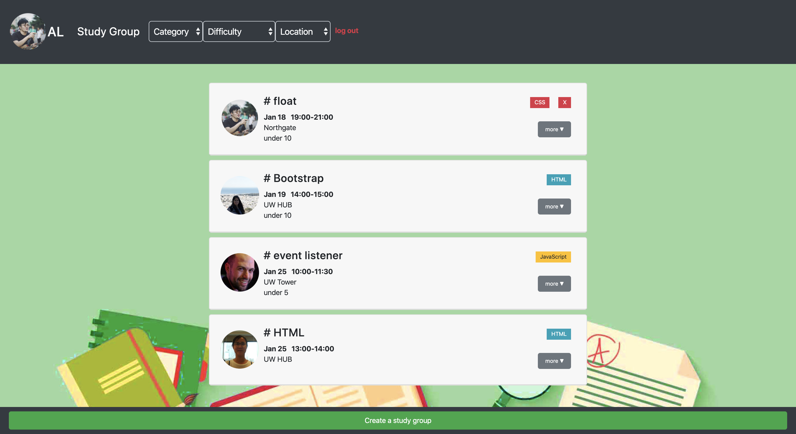

# Study Group

Online community for coding-lovers to either create or find local study groups.

> [Live Demo!](https://andrewlin618.github.io/Study-Group/)

* [About The Project](#about-the-project)
  * [Build With](#build-with)
* [Getting Started](#getting-started)
  * [Installation](#installation)
  * [Usage](#usage)
  * [3rd Party APIs](#3rd-Party-APIs)
  * [Stretch Goals](#stretch-goals)
* [Authors](#authors)
* [Contact](#contact)

## About The Project

</img>

This web application is built for coding-lovers looking for local study groups.

1. The user is able to create and delete his/her study group, specify topics, and the web will recommend questions and books related to this topic.

2. The user is also able to join/quit other user's study group, leave messages.

3. The admin is able to delete all users' study groups.

### Build With
- HTML
- CSS
- JavaScript/jQuery
- Bootstrap.js
- Firebase 

## Getting Started

### Installation
1. Get a local clone of the repo
```
git clone https://github.com/andrewlin618/Study-Group.git
```

### Usage
1. Open index.html in your browser;

- Create a new study group.
  - Select a category
  - Select the level of difficulty
  - Select the capacity of the study group
  - Add a discussion topic
    > Get FAQs & books recommendation of this topic
  - Add location
  - Add time

- Join or quit a study group created by others.

- Chatbox under each study group.

### 3rd Party APIs
- Open Library API (for books recommendation)
- Stack Exchange API (for FAQs on Stack Overflow)

### Stretch Goals
- Use Google Location API.
- Add filter function for the category, location, time, etc.
- Add the user's homepage for more convenient management.

## Authors
* [**Andrew Lin**](https://github.com/andrewlin618)
* **Swathi Pottigari**
* **Joshua Jonas**

## Contact
- LinkedIn: [Andrew Lin](https://www.linkedin.com/in/andrewlin618)
- Email:    &nbsp; &nbsp; `andrewlin618@gmail.com`
